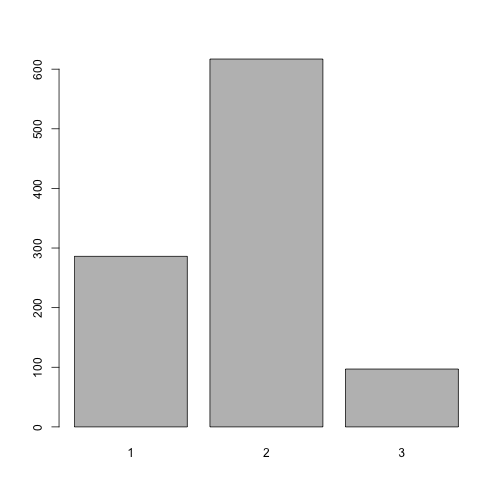

Pitch Presentation For Shiny App.
========================================================
author:Hamoud Alshammari
date:Fri Mar 25 22:27:31 2016
font-family: 'Risque'

Slide 2: Introduction
========================================================

*This is a R presentation part that for Shiny project*

The Shiny project is about a convertor that converts from selected unit to another one.

Slide 3: Explination
========================================================

*This application has three converters as follows:*
- Converts temperature degree form Fahrenheit to Celsius and vise versa.
- Converts wight form kilograms to bounds and vise versa.
- Converts length form meter to inch and vise versa.

Slide 4: R Code
========================================================


```r
barplot(table(sample(1:3, size=1000, replace=TRUE, prob=c(.30,.60,.10))))
```



Slide 5: Conclosion
========================================================

Here I would like to thank all my friends in the course and the teachers of the courses in Coursera.

Hamoud
